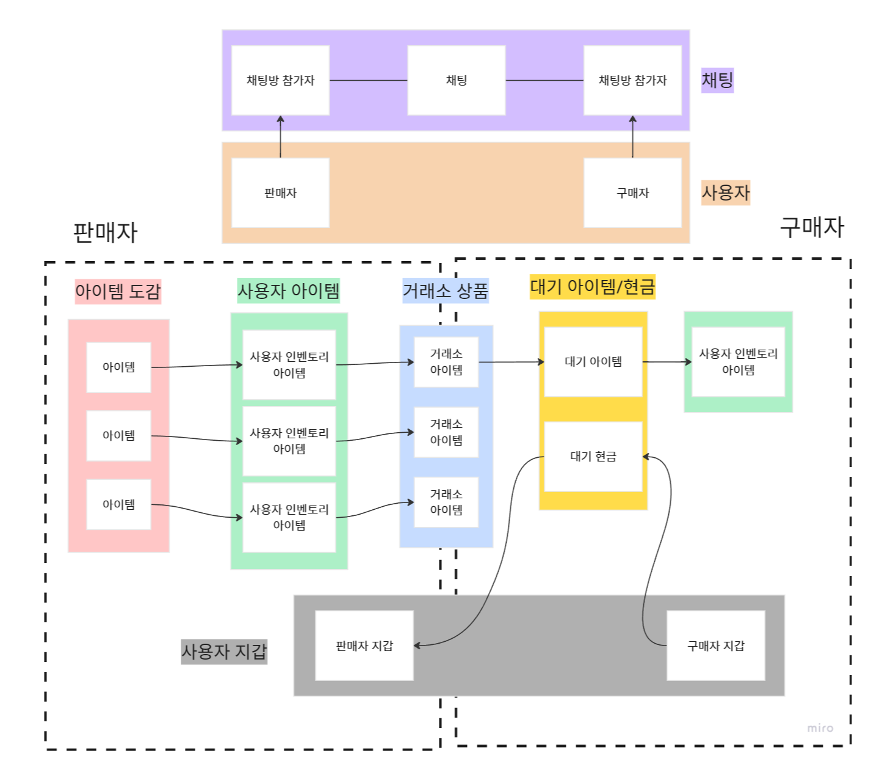
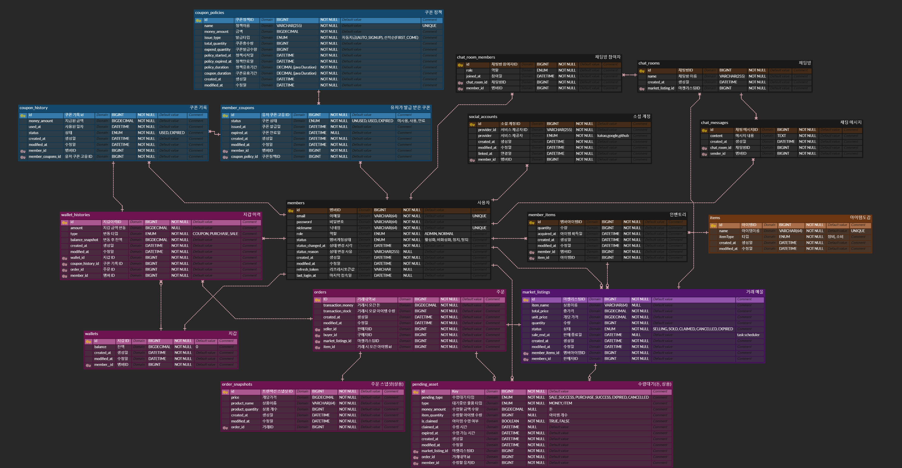

# Game-Trade-System

게임 거래소를 주제로한 e-commerce구현 프로젝트 입니다.

이 프로젝트를 통해 저희는

- 동시성 제어
  - 비관적락 낙관적락, RedissonLock 분산락 활용
  - 낙관적 락은 dev branch에 현재 없습니다, 구현을 보고싶다면 [feat/coupon-lock](https://github.com/team3-commerce/Game-Trade-System/tree/feat/coupon-lock)을 참고해주세요
- caching
  - Caffeine Cache및 redis를 사용
- 실시간 채팅
  - WebSocket + STOMP 기반 채팅 시스템
- CI/CD
  - GitHub Actions를 이용한 자동화 파이프라인
- 성능 테스팅
  - k6 + InfluxDB + Grafana Dashboard 를 이용한 부하 테스트 및 메트릭 수집

을 공부해보고자 했습니다.

# 프로젝트 주제 소개

## 간단한 소개
저희는 가상의 게임서비스를 위한 아이템 거래소를 생성하였습니다.

거래소에서 사용자는 다음과 같은 행위들을 할 수 있습니다.

- 자신의 아이템을 판매
- 타인의 아이템을 구매
- 쿠폰신청
- 쿠폰 사용으로 게임머니 얻기

자세한 비지니스 규칙은 [BUSINESS.md](BUSINESS.md) 파일을 참고해주세요.

## 아이템 거래 흐름도



# API 명세서

API 명세서는 [API.md](API.md)를 참고해주세요.

# ERD



# 빌드

build를 위해서는 jdk 17이 필요합니다.

터미널에서 
```
./gradlew build -x test
```
입력하시면 됩니다.

# 테스팅

현재 테스팅은 Redis와 MySQL이 돌아가는 상태여야 정상적으로 작동합니다.
그렇기 때문에 docker compose를 이용해 Redis와 MySQL 을 띄우고 실행하셔야 합니다.

이를 자동화 하는 `test-all.bat`이라는 파일이 있으니 참고해주세요.

# 실행

실행을 위해서는 jdk 17, Redis, MySQL이 필요합니다.

## 실행 설정

기본적인 설정은 application.yml에 있습니다.

### 인증인가 설정

social login에 관한 설정은 https://docs.spring.io/spring-security/reference/servlet/oauth2/login/core.html을 참고해 주세요.

소셜 서비스별 Client ID 발급처

- Google : Google Cloud Console (https://console.cloud.google.com/) - OAuth 2.0 클라이언트 ID 생성
- Kakao : Kakao Developers (https://developers.kakao.com/) - 애플리케이션 등록 후 'REST API 키' 사용
- GitHub : GitHub Developer Settings (https://github.com/settings/developers) - New OAuth App 생성

### 디버깅/개발 설정

```
# 아래 설정들은 프로파일이 prod가 아닐 경우에만 돌아갑니다.

# dummy data들을 추가합니다
dummy:
  # dummy data를 추가합니다.
  enabled: true

  # dummy data를 무엇을 추가할지 설정합니다.
  #   member_only - 회원만 추가
  #   item_only - 아이템만 추가
  #   member_item_with_base - 회원, 아이템, 회원 아이템 추가
  #   market_listing_with_base - 회원, 아이템, 회원 아이템, 거래소 목록 추가
  #
  mode: member_only

  # 각 항목의 횟수를 정합니다.
  member-count: 100000
  item-count: 1000
  member-item-count: 100000
  market-listing-count: 50000 # member-item-count 보다 작거나 같은 경우에만 더미 데이터 생성 가능

app:
  debug-api:
    # debugging api를 활성화 합니다.
    enabled : true
  # 초기 쿠폰을 등록합니다.
  add-test-signup-coupon: true 
  # 초기 아이템, 회원, 회원 아이템을 등록합니다
  add-test-memberitems: true
```

# 프로젝트 구조

```
.
├───db-images -- dockerBuilder로 만든 테스트용 tar 파일들이 사는 곳
├───influxdb -- k6 테스트 결과를 저장하기위한 influx db 초기 sql
├───k6 -- k6 테스트 스크립트
├───misc -- 기타 docker compose 설정들과 spring 설정들
└───src
    ├───main -- application 코드
    ├───test -- 테스트 코드
    └───tool -- dockerBuilder라는 개발용 도구
```

```
──src/main/java/com/example/tradedemo/
  ├───auth -- 인증인가
  │   ├───config -- 인증인가 설정
  │   ├───consts -- 인증인가 상수
  │   ├───controller
  │   ├───dto
  │   ├───filter
  │   ├───interceptor
  │   ├───provider
  │   └───service
  ├───common -- 공용 객체
  │   ├───annotation -- 공통 annotation (redis를 이용한 동시성 제어가 여기에 있습니다)
  │   ├───aspect -- 공통 aspect (redis를 이용한 동시성 제어가 여기에 있습니다)
  │   ├───config -- 공통 설정
  │   ├───consts  -- 공용 상수
  │   ├───converter
  │   ├───dto -- 공통 응답 DTO
  │   ├───entity
  │   ├───exception -- 공통 에러
  │   └───initializer -- seeding 및 개발시 데이터 생성
  └───domain -- 도메인 객체들
      ├───chat -- 채팅
      ├───coupon -- 쿠폰
      ├───debug  -- 개발/디버깅
      ├───item -- 아이템 도감
      ├───marketlistings -- 거래소 상품
      ├───members -- 회원
      ├───order -- 거래시 생성되는 주문
      ├───pending -- 대기중 아이템
      ├───scheduler -- 공통 quartz scheduler job
      └───wallet -- 회원 지갑
```

## 기여자분들 ❤️
 
- [Perfect-Bee](https://github.com/Perfect-Bee)
  - 역할: 거래 및 지갑, CICD 배포
  - blog: https://velog.io/@parslime/posts

- [hanbi67](https://github.com/hanbi67)
  - 역할: 쿠폰, 실시간 채팅 
  - blog: https://velog.io/@dlql6717/posts

- [hyuham1335-stack](https://github.com/hyuham1335-stack)
  - 역할: 인벤토리 / 상품 / 인기검색어 조회, k6를 이용한 성능 테스트, 인덱싱 
  - blog: https://hhw1.tistory.com/?page=1

- [ilsamkim](https://github.com/ilsamkim)
  - 역할: 인증 인가 / 소셜 로그인 / 전체적인 refactoring
  - blog: https://velog.io/@ilsamkim/posts

- [imprity](https://github.com/imprity)
  - 역할: 아이템 도감 조회및 검색 구현, K6를 이용한 성능 테스팅
  - blog: https://velog.io/@imprity/posts
