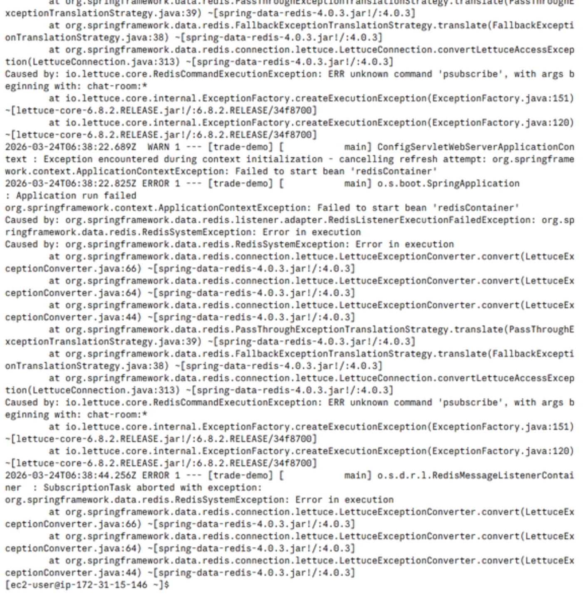
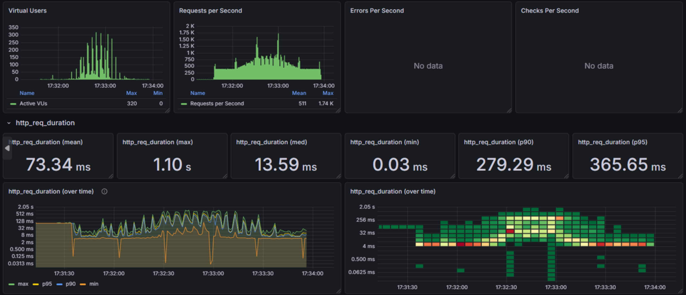
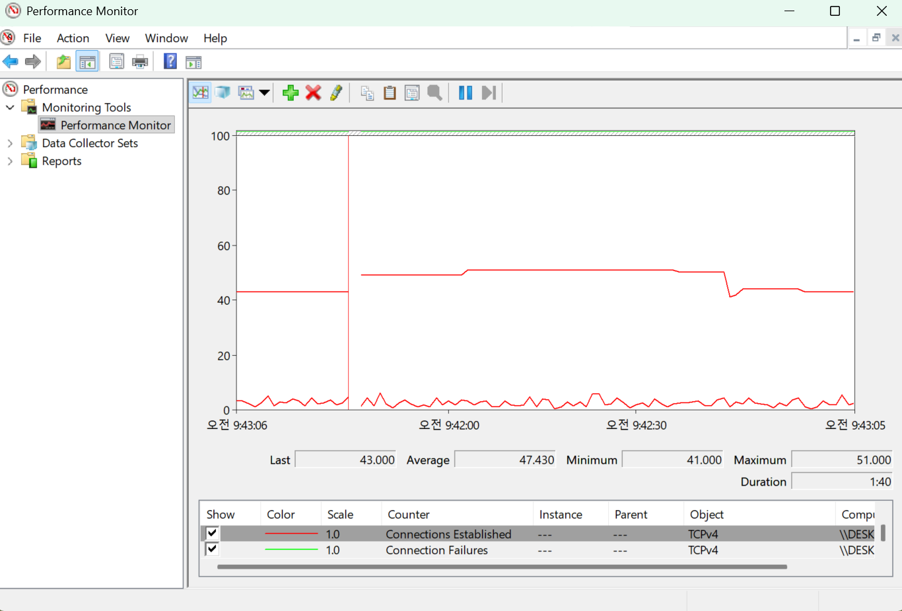

# Perfect-Bee

ElasticCache는 구조가 분산 구조와 단일 서버 구조가 있습니다.

원래는 분산구조로 가기로 했지만 분산 구조로 했을 경우 psubscribe 명령어를 지원하지 않았습니다.



해결책은 두가지가 있었습니다.

1. psubscribe대신 다른 명령어를 사용하도록 코드를 수정한다.
2. ElasticCache를 단일 서버 구조로 변경한다.

다른 문제가 발생 할수도 있다 생각했기 때문에 2번으로 가기로 했습니다.

# hanbi67

## [TIL] 선착순 쿠폰 발급 DeadLock 문제

### 문제 상황
Redis 분산락을 적용한 선착순 쿠폰 발급 V2를 구현하고 150명의 동시 요청으로 테스트를 진행했다. 쿠폰은 100개가 발급되어야 정상인데, 결과는 다음과 같이 나왔다.

```
========================================
쿠폰 총 수량: 100
동시 요청 수: 150
실제 DB 발급 수: 32
expendQuantity: 18
========================================

MemberCoupon → 32개
CouponPolicy.expendQuantity → 18개
```

실제 쿠폰을 발급받은 사람은 32명인데, 쿠폰 발급 시 쿠폰 정책의 발급된 수량(expendQuantity)이 업데이트 되지 않아 수량 정합성이 깨지는 문제가 발생했다.

⇒  **동시 요청 시 발급 수량 불일치**

### 원인 분석
``` java
@Transactional
public void issueFirstComeCouponV2(Long couponPolicyId, Member member) {
    String lockKey = lockService.buildLockKey(couponPolicyId);
    String lockValue = lockService.acquireLock(lockKey); // 락 획득

    try {
        // 선착순 쿠폰 발급 신청 로직(V1)
        CouponPolicy couponPolicy = couponPolicyRepository
                .findByIdAndIssueType(couponPolicyId, IssueType.FIRST_COME)
                .orElseThrow(() -> new ServiceException(ErrorEnum.ERR_COUPON_POLICY_NOT_FOUND));

        if (!couponPolicy.isIssuable()) {
            throw new ServiceException(ErrorEnum.ERR_COUPON_POLICY_SOLD_OUT);
        }

        if (memberCouponRepository.existsByMemberAndCouponPolicy(member, couponPolicy)) {
            throw new ServiceException(ErrorEnum.ERR_COUPON_ALREADY_ISSUED);
        }

        LocalDateTime issuedAt = LocalDateTime.now();

        LocalDateTime expiredAt = issuedAt.plus(couponPolicy.getCouponDuration());

        memberCouponRepository.save(MemberCoupon.create(member, couponPolicy, issuedAt, expiredAt));

        couponPolicy.increaseExpendQuantity();

    } finally {
        // 락 해제
        lockService.releaseLock(lockKey, lockValue); 
    }
}
```

트랜잭션은 `@Transactional`이 붙은 issueFirstComeCouponV2의 메서드가 완전히 끝나야 커밋되는데, `LockService`가 락을 해제하는 시점은 `finally` 블록 안이라 트랜잭션이 커밋되기 전에 Lock을 해제하니 다음 대기 1번이 **DB에 갱신되기 전의 expendQuantity 값을 읽고 쿠폰 발급을 진행**하기 때문에 아래와 같이 실행된다.

[1번째 사람]
expendQuantity = 10 로 조회
MemberCoupon 발급
expendQuantity = 11 로 업데이트(DB에 미반영 상태)
Lock 해제

[2번째 사람]
커밋 전에 Lock 획득
**expendQuantity = 10 로 조회**
MemberCoupon 발급
expendQuantity = 11 로 업데이트(DB에 미반영 상태)
Lock 해제
트랜잭션 커밋

때문에 트랜잭션이 완전히 커밋된 후 Lock을 해제 해주어야 이런 DeadLock 문제가 발생하지 않는다.

### 해결 과정
쿠폰 발급 신청 로직을 메서드로 분리해 완전히 커밋된 후 Lock 해제 할 수 있게 해야한다.

`@Transactional` 의 범위와 Lock의 범위를 분리하기 위해

Lock을 관리하는 메서드에서 @Transactional 을 제거하고, ‘쿠폰 발급 신청 로직’ 메서드에만 @Transactional 을 붙인다.

이때, 메서드로 분리하는 방법은 2가지로

1. 같은 CouponService 클래스 내에 메서드를 분리해 사용하는 Self Injection 방법

2. 다른 클래스에 메서드를 분리해 사용하는 방법

이 중 다른 클래스에 메서드를 분리해 사용하는 방법을 선택했다.

``` java
public void issueFirstComeCouponV2(Long couponPolicyId, Member member) {
        String lockKey = lockService.buildLockKey(couponPolicyId);
        String lockValue = lockService.acquireLock(lockKey); // 락 획득

        try {
            // DeadLock 발생 -> 기존 로직을 트랜잭션 분리
            couponIssueService.issueFirstComeCouponV2(couponPolicyId, member);
        } finally {
            lockService.releaseLock(lockKey, lockValue); // 락 해제
        }

    }
```

### 결과

```
V2 테스트 결과========================================  쿠폰 총 수량:        100
동시 요청 수:        150
실제 DB 발급 수:      100
expendQuantity:    100
========================================

MemberCoupon → 100개
CouponPolicy.expendQuantity → 100개
```

실제 쿠폰을 발급받은 사람 100명, 쿠폰 발급 시 쿠폰 정책의 발급된 수량(expendQuantity) 100개로 수량이 일치하면서 문제가 해결되었다.

# hyuham1335-stack

K6로 테스트할시 저는 K6의 결과를 모니터링 하기위해 InfluxDB와 Grafana Dashboard를 사용하고 있었습니다.

하지만 테스트를 돌리는 중 InfluxDB와 Grafana Dashboard를 사용하지 않고 테스트한 결과 보다 수치가 매우 다르게 나오는 문제가 발생했습니다.



- 부하 테스트 전 구간에서 CPU 사용률 100% 유지
- VU 등락폭이 매우 큼 (처리 속도 불균일)
- 설정한 RPS가 안정적으로 나오지 않음
- median 값은 낮지만 p(95) 값은 높게 나옴

그래서 한 컴퓨터에서 InfluxDB와 Grafana Dashboard, K6, Spring 이 네 프로그램을 동시에 돌려 CPU가 과부화 되었다는 생각이 들어 Influxdb, Grafana를 종료하여 CPU 사용률을 낮춘 결과

p(95) 가 76%로 감소한걸을 확인했습니다.

### InfluxDB와 Grafana Dashboard 끄기전


### InfluxDB와 Grafana Dashboard 끈후


리소스 경쟁 환경에서는 테스트 데이터의 신뢰도가 떨어질 수 있다는 것을 확인했습니다.

# ilsamkim

## Spring Security 예외까지 ApiResponse로 감싸기 (V1)

### Security 예외를 따로 처리해야 하는 이유
#### 문제 발생
프로젝트에 기능적인 코드를 쌓기 전에 API응답을 다음과 같이 ApiResponse 형식으로 통일했다.

```
{
    "success": false,
    "data": null,
    "code": "400",
    "error": "잘못된 요청입니다",
    "timestamp": "2026/03/12"
}
```

하지만 Spring Security의 필터 계층에서 인증(401)이나 인가(403)예외가 발생하면, 우리가 설정한 GlobalExceptionHandler가 작동하지 않았다.

#### 이유 분석
Spring Security 필터의 위치 때문에 이러한 현상이 발생했다.

- GlobalExceptionHandler : 스프링 MVC 컨텍스트 내부에서 발생하는 예외만 처리 (Controller 이후)

- Security Filter : 스프링 MVC 진입하기 전, 서블릿 필터 계층에서 동작

즉, 필터 계층에서 인증이 거부되면 Controller까지 요청이 도달하지 못하므로 @ExceptionHandler가 예외를 낚아챌 기회가 없다.

#### 결론
프론트엔드 개발자는 어떤 에러가 발생하더라도 동일한 JSON 구조를 파싱하도록 설계한다.
갑자기 튀어나오는 규격 외의 에러 응답은 클라이언트 측의 예외 처리를 망가뜨릴 수 있다.
따라서 AccessDeniedHandler와 AuthenticationEntryPoint를 직접 구현하여 보안 예외도 우리만의 규격으로 감싸주어야 한다.

---

### 핵심 인터페이스 구현
#### (1) 인증 실패 처리 (401 Unauthorized)
토큰이 없거나 만료된 토큰으로 접근할 때 호출되는 AuthenticationEntryPoint를 구현한다.

``` java
@Component
@RequiredArgsConstructor
public class CustomAuthenticationEntryPoint implements AuthenticationEntryPoint {

    private final ObjectMapper objectMapper;

    @Override
    public void commence(HttpServletRequest request, HttpServletResponse response, 
                         AuthenticationException authException) throws IOException {

        response.setContentType("application/json;charset=UTF-8");
        response.setStatus(HttpServletResponse.SC_UNAUTHORIZED);

        // 프로젝트 공통 규격인 ApiResponse.fail 사용
        ApiResponse<Void> apiResponse = ApiResponse.fail(
                String.valueOf(HttpStatus.UNAUTHORIZED.value()), 
                "인증이 필요하거나 유효하지 않은 토큰입니다"
        );

        String responseBody = objectMapper.writeValueAsString(apiResponse);
        response.getWriter().write(responseBody);
    }
}
```
#### (2) 인가 실패 처리 (403 Forbidden)
로그인은 성공했으나, 일반 유저가 어드민의 API(hasRole("ADMIN"))에 접근하는 등 권한이 부족할 때 호출되는 AccessDeniedHandler를 구현한다.

``` java
@Component
@RequiredArgsConstructor
public class CustomAccessDeniedHandler implements AccessDeniedHandler {

    private final ObjectMapper objectMapper;

    @Override
    public void handle(HttpServletRequest request, HttpServletResponse response, 
                       AccessDeniedException accessDeniedException) throws IOException {

        response.setContentType("application/json;charset=UTF-8");
        response.setStatus(HttpServletResponse.SC_FORBIDDEN);

        ApiResponse<Void> apiResponse = ApiResponse.fail(
                String.valueOf(HttpStatus.FORBIDDEN.value()), 
                "접근 권한이 없습니다"
        );

        String responseBody = objectMapper.writeValueAsString(apiResponse);
        response.getWriter().write(responseBody);
    }
}
```
#### (3) SecurityConfig 설정 등록
작성한 커스텀 핸들러들을 SecurityFilterChain 설정의 exceptionHandling에 등록한다.

``` java
@Configuration
@EnableWebSecurity
@RequiredArgsConstructor
public class SecurityConfig {

    private final CustomAccessDeniedHandler customAccessDeniedHandler;
    private final CustomAuthenticationEntryPoint customAuthenticationEntryPoint;

    @Bean
    public SecurityFilterChain filterChain(HttpSecurity http, JwtTokenProvider jwtTokenProvider) throws Exception {
        http
            // ... (CSRF, Session, authorizeHttpRequests 설정 생략)
            .exceptionHandling(exception -> exception
                    .authenticationEntryPoint(customAuthenticationEntryPoint) // 401 등록
                    .accessDeniedHandler(customAccessDeniedHandler)           // 403 등록
            );

        return http.build();
    }
}
```
## 기술적 포인트 요약
- 관심사의 분리 : 비즈니스 예외는 GlobalExceptionHandler에서, 보안 예외는 SecurityConfig의 핸들러에서 처리하여 명확히 분리했다

- 직렬화(Serialization) : 필터 계층은 스프링의 메시지 컨버터가 자동으로 작동하지 않으므로, objectMapper.writeValueAsString()을 통해 직접 JSON 문자열로 변환하여 응답 스트림에 기록해야 한다

- HTTP 상태 코드 동기화 : response.setStatus()를 통해 실제 HTTP 상태 코드와 ApiResponse 내부의 code 값을 일치시켜 클라이언트가 혼선이 없도록 배려했다

## 결과 확인
코드를 적용하고 권한이 없는 유저가 관리자 기능을 호출하면 다음과 같은 응답을 받게 된다.

```
{
    "success": false,
    "data": null,
    "code": "403",
    "error": "접근 권한이 없습니다",
    "timestamp": "2026/03/12"
}
```

# imprity

k6 로 테스트를 하면서 VU가 많아지면 네트워크가 연결이 죽는 상황이 많이 발생했다.

동시 TCP connection이 많아지면 많아 질수록 더 많이 죽어가는 거 같았기에 혹시 내 local network에서 연결을 할수 있는데에 제한이 걸려있는지 조사하면서 Ephemeral Port 에 대해서 알게 되었다.

## 실험


간단한 Spring 서버를 준비하고
``` java
package com.template;

import org.springframework.boot.SpringApplication;
import org.springframework.boot.autoconfigure.SpringBootApplication;
import org.springframework.web.bind.annotation.RestController;
import org.springframework.web.bind.annotation.GetMapping;

@SpringBootApplication
public class TemplateApplication {
    @RestController
    public static class SimpleController {
        @GetMapping("/hello") 
        public String sayHello() throws Exception {
            Thread.sleep(100);
            return "hello";
        }
    }

    public static void main(String[] args) {
        SpringApplication.run(TemplateApplication.class, args);
    }
}
```
간단한 K6 script를 작성한 다음에
```javascript
import exec from 'k6/execution';
import http from 'k6/http';

export const options = {
    setupTimeout: '5m',

    scenarios: {
        ddos : {
            executor: 'per-vu-iterations',
            vus: 10000,
            iterations: 10,
            maxDuration: '30s',
        },
    },
};

export default function(datas) {
    const url = `http://localhost:8080/hello`;
    http.get(url, {});
}

```



perfmon이라는 윈도우 프로그램을 통해 TCP connection이 얼마나 많이 만들어 지는지, 그리고 얼마나 많이 실패하는지 확인해 보자

현재 connection은 31개 정도이고
실패한 connection은 157615개 이다.

그리고 실험을 한후

connection은 16617개로 올랐고
connection실패도 183594개로 올랐다.

최대 connection이 31 -> 16617 즉 16586 개로 증가했고
connection 실패는 183594 -> 157615 즉 25979 개 증가했다.

왜 이런 현상이 발생하는 걸까?

## Ephemeral Port

OS는 TCP connection을 만들때 임의로 connection에 포트를 부여하여 관리한다.
port는 최대 0 - 65535 까지 있으며 이중에서 윈도우즈에서는 49152-65535 까지가 이 용도로 활용된다.

이는 다음과 같은 명령어로 확인해 볼수 있다.
```
C:>netsh int ipv4 show dynamicport tcp

Protocol tcp Dynamic Port Range
---------------------------------
Start Port      : 49152
Number of Ports : 16384
```

65535 - 49152+1 = 16,384, 우리가 아까본 connection의 갯수와 거의 유사하다.

## 더 공부해보아야 할점

근데 왜 살짝 다를까?

